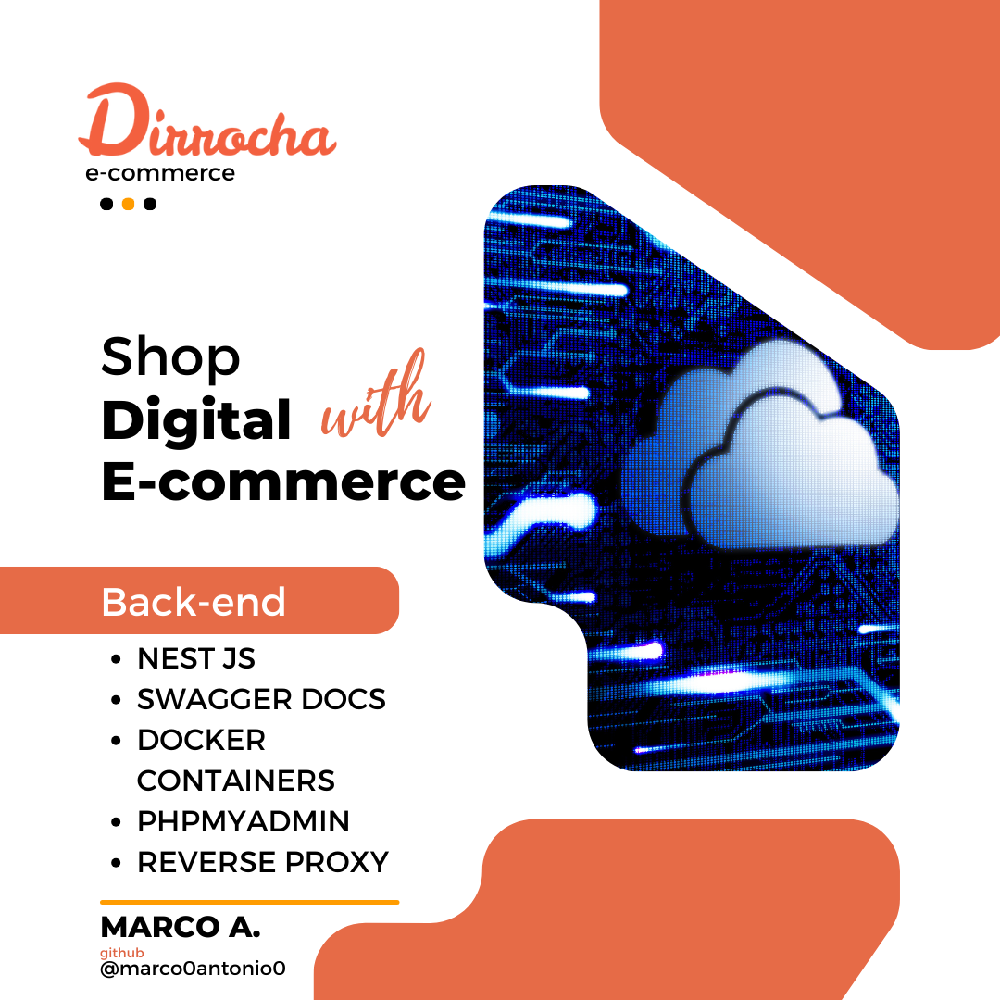

# Back-End E-commerce



Este projeto é uma aplicação de e-commerce desenvolvida para o teste tecnico. O back-end foi construído utilizando NestJS e inclui funcionalidades de autenticação, gerenciamento de carrinho e integração com APIs de fornecedores para listar produtos.

### Acesso aos Endpoints

- [Acesso Endpoints web](https://e-commerce-api.dirrocha.com/api-docs)
- [Acesso phpMyAdmin web](https://e-commerce-php.dirrocha.com/)
- [Acesso Swagger docs web](https://e-commerce-api.dirrocha.com/api-docs)

### Índice Rápido

- [Estrutura do Projeto](#estrutura-do-projeto)
- [Documentação dos Endpoints](#documentação-dos-endpoints)
- [Como Acessar a Documentação Swagger](#acessando-a-documentação-da-api)
- [Passos para Configuração](#passos-para-configuração)
<!-- - [Tecnologias Utilizadas](#tecnologias-utilizadas) -->

## Visão Geral do Projeto

Este back-end foi desenvolvido como parte de um desafio técnico para a construção de um sistema de e-commerce. A aplicação lida com funcionalidades cruciais, como a autenticação de usuários, o gerenciamento de carrinho de compras, e a integração com APIs de fornecedores para a listagem de produtos.

### Decisões de Desenvolvimento


- **Escolha do NestJS**: O NestJS foi escolhido devido à sua estrutura modular e à facilidade com que permite escalar aplicações Node.js. O uso de TypeScript garantiu tipagem estática, o que melhora a qualidade do código e reduz erros em tempo de execução.

- **Integração com APIs de Fornecedores**: A integração com APIs de fornecedores externos foi projetada para ser eficiente e segura. A aplicação consome dados de produtos dessas APIs e os disponibiliza aos usuários finais.

- **Autenticação JWT**: Implementou-se a autenticação via JWT (JSON Web Token) para garantir a segurança das sessões dos usuários, mantendo os dados protegidos.

- **Persistência de Dados com Sequelize**: Para a camada de persistência, foi utilizado o Sequelize como ORM, o que facilita a interação com o banco de dados e garante a portabilidade do código.

    ```env
    DB_ROOT_USER='root'
    DB_PASSWORD='your_password'
    DB_DATABASE='empreendimento'
    SECRET_KEY='your_env'
    PROD='false'
    ```

4. **Inicie o servidor:**

    ```sh
    npm run start
    ```

5. **Acesse a documentação da API:**
   - A documentação do Swagger estará disponível em <http://localhost:3000/api-docs>

### Estrutura do Projeto

```plaintext
├── src/
│   ├── auth/
│   │   ├── models/
│   │   │   └── token.dto.ts
│   │   ├── services/
│   │   │   ├── abstract-auth.service.ts
│   │   │   └── auth.service.ts
│   │   └── auth.module.ts
│   │
│   ├── config/
│   │   └── databasse.config.ts
│   │
│   ├── guard/
│   │   └── jwt-auth.guard.ts
│   │
│   ├── cart/
│   │   ├── controllers/
│   │   │   └── cart.controller.ts
│   │   ├── models/
│   │   │   └── cart.dto.ts
│   │   ├── repositories/
│   │   │   ├── entity/
│   │   │   │   └── cart.entity.ts
│   │   │   ├── abstract-repository-cart.service.ts
│   │   │   └── repository-cart.service.ts
│   │   ├── services/
│   │   │   ├── cart.service.ts
│   │   │   └── abstract-cart.service.ts
│   │   └── cart.module.ts
│   │
│   ├── products/
│   │   ├── controllers/
│   │   │   └── products.controller.ts
│   │   ├── services/
│   │   │   ├── abstract-products.service.ts
│   │   │   └── products.service.ts
│   │   └── products.module.ts
│   │
│   └── user/
│       ├── controllers/
│       │   └── user.controller.ts
│       ├── models/
│       │   ├── user-models.dto.ts
│       │   └── user.dto.ts
│       ├── repositories/
│       │   ├── entity/
│       │   │   └── user.entity.ts
│       │   ├── abstract-repository-user.service.ts
│       │   └── repository-user.service.ts
│       ├── services/
│       │   ├── user.service.ts
│       │   └── abstract-user.service.ts
│       └── user.module.ts
│
├── app.module.ts
├── main.ts
├── test/
├── docker-compose.yml
├── .env
├── .eslintrc.js
├── .gitignore
├── .prettierrc
└── .swcrc
```

# Documentação dos Endpoints


- [Acesso Swagger docs web online](https://e-commerce-api.dirrocha.com/api-docs)

## UserController

### POST /user/login

#### Descrição

Autenticação de usuário.

#### Request Body

```json
{
  "email": "user@example.com",
  "password": "password123"
}
```

#### Respostas

- **200 OK**: Login bem-sucedido.

  ```json
  {
    "token": "jwt_token"
  }
  ```

- **401 Unauthorized**: Credenciais inválidas.

### POST /user/register

#### Descrição

Registro de um novo usuário.

#### Request Body

```json
{
  "name": "John Doe",
  "email": "user@example.com",
  "password": "password123"
}
```

#### Respostas

- **201 Created**: Registro bem-sucedido.

  ```json
  {
    "token": "jwt_token"
  }
  ```

### POST /user/check-token

#### Descrição

Validação da chave de autenticação de usuário.

#### Request Body

  ```json
  {
    "token": "asdasdasodnoi ...",
  }
```

#### Respostas

- **200 OK**: Login bem-sucedido.

  ```json
  {
    "data": {...}
  }
  ```

- **401 Unauthorized**: Credenciais inválidas.

## ProductsController

### GET /products

#### Descrição

Recupera todos os produtos.

#### Respostas

- **200 OK**: Lista de todos os produtos.

  ```json
  [
    {
      "id": "1",
      "name": "Product 1",
      "description": "This is product 1",
      "price": 100
    },
    {
      "id": "2",
      "name": "Product 2",
      "description": "This is product 2",
      "price": 200
    }
  ]
  ```

### GET /products/:provider/:id

#### Descrição

Recupera um produto pelo ID e o Provide do produto.

#### Parâmetros

- `id`: ID do produto.
- `provider`: provedor do produto.

#### Respostas

- **200 OK**: Produto especificado recebido.

  ```json
  {
    "id": "1",
    "name": "Product 1",
    "provider": "Brazilian",
    "description": "This is product 1",
    "price": 100
    ...
  }
  ```

- **404 Not Found**: Produto não encontrado.

### GET /products/search?name=queryName

#### Descrição

Recupera um produto pelo nome. Utiliza da biblioteca fuzy.js para fazer comparativos e logica fuzy para trazer a melhor correspondencia com base no nome

#### Parâmetros

- `name`: Nome do produto.

#### Respostas

- **200 OK**: Produto com o ID especificado.

  ```json
  [  
    {
      "id": "1",
      "name": "Product 1",
      "provider": "Brazilian",
      "description": "This is product 1",
      "price": 100
      ...
    }
    ]
  ```

- **404 Not Found**: Produto não encontrado.

## CartController

### POST /cart

#### Descrição

Adiciona um item ao carrinho.

#### Request Body

```json
{
  "productId": "1",
  "quantity": 1
}
```

#### Respostas

- **201 Created**: Item adicionado ao carrinho com sucesso.

  ```json
  {
    "id": "1",
    "productId": "1",
    "quantity": 1,
    "userEmail": "user@example.com"
  }
  ```

- **401 Unauthorized**: Campo de e-mail não pode ser nulo.

### GET /cart

#### Descrição

Recupera todos os itens no carrinho.

#### Respostas

- **200 OK**: Itens do carrinho recuperados com sucesso.

  ```json
  [
    {
      "id": "1",
      "productId": "1",
      "quantity": 1,
      "userEmail": "user@example.com"
    },
    {
      "id": "2",
      "productId": "2",
      "quantity": 2,
      "userEmail": "user@example.com"
    }
  ]
  ```

- **401 Unauthorized**: Não autorizado.

### GET /cart/purchased

#### Descrição

Recupera todos os itens no carrinho que ja foram comprados pelo cliente.

#### Respostas

- **200 OK**: Itens do carrinho recuperados com sucesso.

  ```json
  [
    {
      "id": "1",
      "productId": "1",
      "quantity": 1,
      "userEmail": "user@example.com"
    },
    {
      "id": "2",
      "productId": "2",
      "quantity": 2,
      "userEmail": "user@example.com"
    }
  ]
  ```

- **401 Unauthorized**: Não autorizado.

### PATCH /cart/:productId

#### Descrição

Atualiza um item no carrinho.

#### Parâmetros

- `productId`: ID do produto.

#### Request Body

```json
{
  "quantity": 2
}
```

#### Respostas

- **200 OK**: Item do carrinho atualizado com sucesso.

  ```json
  {
    "id": "1",
    "productId": "1",
    "quantity": 2,
    "userEmail": "user@example.com"
  }
  ```

- **401 Unauthorized**: Campo de e-mail não pode ser nulo.

### DELETE /cart/:productId

#### Descrição

Remove um item do carrinho.

#### Parâmetros

- `productId`: ID do produto.

#### Respostas

- **204 No Content**: Item do carrinho removido com sucesso.
- **401 Unauthorized**: Não autorizado.

### DELETE /cart/clear

#### Descrição

Limpa todos os itens do carrinho.

#### Respostas

- **204 No Content**: Carrinho limpo com sucesso.
- **401 Unauthorized**: Não autorizado.

### POST /cart/finalize

#### Descrição

Finaliza a compra.

#### Respostas

- **200 OK**: Compra finalizada com sucesso.
- **401 Unauthorized**: Não autorizado.

# Acessando a Documentação da API

Para acessar a documentação interativa da API, você pode utilizar o Swagger. A documentação estará disponível em:

```
http://localhost:3000/api-docs
```

A partir dessa URL, você poderá explorar e testar os endpoints da API de maneira intuitiva.
